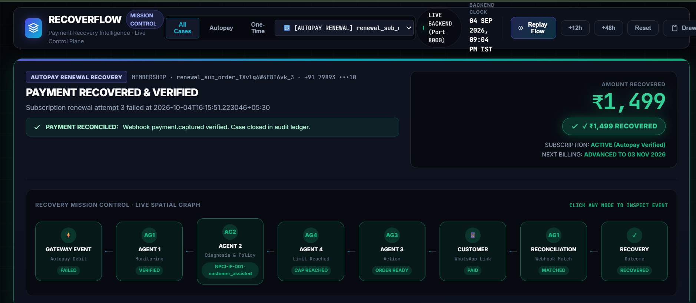
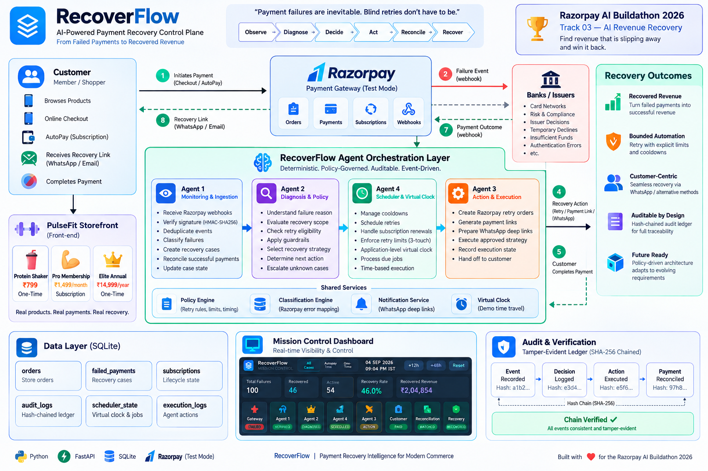

<div align="center">

# RecoverFlow

### Payment failures are inevitable. Blind retries don't have to be.

**Razorpay AI Buildathon 2026 · Track 03 — AI Revenue Recovery**


</div>

---

> **A failed payment is not lost revenue. It is an operational decision point.**
>
> Traditional recovery mechanisms treat every failed transaction as a generic retry problem. RecoverFlow reframes payment recovery as a policy-governed control plane: every failure is classified, diagnosed, evaluated against operational guardrails, routed to a bounded recovery strategy, and proven only when actual funds reconcile against the gateway.



---

## Table of Contents

- [The 30-Second Overview](#the-30-second-overview)
- [The Problem: Why Blind Retries Fail](#the-problem-why-blind-retries-fail)
- [2026 Context: Payment Recovery Is a Policy Problem](#2026-context-payment-recovery-is-a-policy-problem)
- [The RecoverFlow Thesis](#the-recoverflow-thesis)
- [Core System Architecture](#core-system-architecture)
- [The Four Specialized Agents](#the-four-specialized-agents)
  - [Agent 1: Monitoring & Ingestion](#agent-1-monitoring-ingestion)
  - [Agent 2: Diagnosis & Policy Engine](#agent-2-diagnosis-policy-engine)
  - [Agent 3: Action & Execution](#agent-3-action-execution)
  - [Agent 4: Scheduler & Virtual Clock](#agent-4-scheduler-virtual-clock)
- [Key Differentiator: Separation of Concerns](#key-differentiator-separation-of-concerns)
- [Flagship Recovery Workflows](#flagship-recovery-workflows)
  - [Workflow 1: Shaker Bottle (₹799) — One-Time Purchase](#workflow-1-shaker-bottle-799-one-time-purchase)
  - [Workflow 2: Elite Annual Pass (₹14,999) — High-Value One-Time](#workflow-2-elite-annual-pass-14999-high-value-one-time)
  - [Workflow 3: Pro Membership (₹1,499) — Initial Subscription Checkout](#workflow-3-pro-membership-1499-initial-subscription-checkout)
  - [Workflow 4: Multi-Day Autopay Renewal Lifecycle](#workflow-4-multi-day-autopay-renewal-lifecycle)
- [Bounded Automation & Policy Guardrails](#bounded-automation-policy-guardrails)
- [AI & Intelligence: Deterministic Financial Execution](#ai-intelligence-deterministic-financial-execution)
- [Cryptographic Hash-Chained Audit Ledger](#cryptographic-hash-chained-audit-ledger)
- [Payment Recovery Mission Control](#payment-recovery-mission-control)
- [Application Virtual Clock Engine](#application-virtual-clock-engine)
- [Razorpay Webhook Integration & Local ngrok Setup](#razorpay-webhook-integration-local-ngrok-setup)
- [WhatsApp Recovery Deep-Link Mechanics](#whatsapp-recovery-deep-link-mechanics)
- [Real Engineering Lesson: Vendor Error Semantics](#real-engineering-lesson-vendor-error-semantics)
- [End-to-End Test Matrix & Verification](#end-to-end-test-matrix-verification)
- [Verified API Surface Reference](#verified-api-surface-reference)
- [Environment Variables](#environment-variables)
- [Real vs. Simulated Capabilities](#real-vs-simulated-capabilities)
- [Repository Structure](#repository-structure)
- [Local Development Setup](#local-development-setup)
- [5-Minute Buildathon Pitch Sequence](#5-minute-buildathon-pitch-sequence)
- [Engineering & Architectural Principles](#engineering-architectural-principles)

---

## The 30-Second Overview

When an online or subscription payment fails in India today, merchants typically do one of two things:
1. **Do nothing**, immediately abandoning the customer and forfeiting high-intent gross merchandise value (GMV).
2. **Retry blindly**, repeatedly pinging the same card or mandate until gateway rate limits, bank blocklists, or customer frustration terminate the relationship.

Neither approach solves the actual problem.

**RecoverFlow** introduces an event-driven control plane between Razorpay and the merchant application. It intercepts payment failures in real time, deterministically diagnoses the underlying root cause, enforces policy-governed retry boundaries, schedules time-aware recovery actions, and verifies true recovery exclusively through cryptographic webhook reconciliation.

```text
┌─────────────────────────────────────────────────────────────────────────────┐
│                              PAYMENT FAILURE                                │
│                       (Razorpay Test Mode Webhook)                          │
└──────────────────────────────────────┬──────────────────────────────────────┘
                                       │
                                       ▼
┌─────────────────────────────────────────────────────────────────────────────┐
│                          AGENT 1 · MONITORING                               │
│        HMAC Verification · Ingestion · Failure Taxonomy Classification      │
└──────────────────────────────────────┬──────────────────────────────────────┘
                                       │
                                       ▼
┌─────────────────────────────────────────────────────────────────────────────┐
│                     AGENT 2 · DIAGNOSIS & POLICY                            │
│     Scope Validation · Touch-Cap Limits · Cooldown Rules · Decision         │
└──────────────────┬───────────────────┬───────────────────┬──────────────────┘
                   │                   │                   │
                   ▼                   ▼                   ▼
            [ IMMEDIATE ]       [ RETRY LATER ]     [ ESCALATE / HALT ]
             alt_method          48h Cooldown        customer_assisted
                   │                   │                   │
                   │                   ▼                   │
                   │          ┌─────────────────┐          │
                   │          │    AGENT 4      │          │
                   │          │    SCHEDULER    │          │
                   │          │  Virtual Clock  │          │
                   │          └────────┬────────┘          │
                   │                   │ (When Due)        │
                   └───────────────────┼───────────────────┘
                                       │
                                       ▼
┌─────────────────────────────────────────────────────────────────────────────┐
│                            AGENT 3 · ACTION                                 │
│        Retry Razorpay Order · Secure Payment Link · WhatsApp Deep Link      │
└──────────────────────────────────────┬──────────────────────────────────────┘
                                       │
                                       ▼
┌─────────────────────────────────────────────────────────────────────────────┐
│                           CUSTOMER INTERACTION                              │
│              Customer opens secure link and pays alternate method           │
└──────────────────────────────────────┬──────────────────────────────────────┘
                                       │
                                       ▼
┌─────────────────────────────────────────────────────────────────────────────┐
│                   RAZORPAY PAYMENT CAPTURED WEBHOOK                         │
│                    Cryptographic HMAC-SHA256 Ingestion                      │
└──────────────────────────────────────┬──────────────────────────────────────┘
                                       │
                                       ▼
┌─────────────────────────────────────────────────────────────────────────────┐
│                             RECONCILIATION                                  │
│       Retry Order ID → Execution Row → Original Case → Status 'paid'        │
│          Zero Subscription Created for One-Time · Ledger Sealed             │
└──────────────────────────────────────┬──────────────────────────────────────┘
                                       │
                                       ▼
┌─────────────────────────────────────────────────────────────────────────────┐
│                        💰 VERIFIED RECOVERED REVENUE                        │
└─────────────────────────────────────────────────────────────────────────────┘
```

---

## The Problem: Why Blind Retries Fail

Modern digital payments in India operate across diverse rails: UPI AutoPay, e-mandates, debit cards with two-factor authentication (AFA), netbanking, and tokenized credit cards. When a transaction fails, treating the failure as a simple binary error causes immediate operational failures:

- **Customer-Caused Failures:** Insufficient funds, incorrect CVV, or expired cards cannot be recovered by hammering the payment gateway. Retrying the same instrument repeatedly burns merchant reputation and incurs gateway decline surcharges.
- **Transient Gateway Failures:** Network timeouts, banking core downtime, and switch unavailability can be recovered, but only if retried after a measured delay rather than in an immediate rapid-fire loop.
- **Mandate Revocations:** Stale or revoked mandates require explicit re-authentication, not silent automated rebilling.
- **Unchecked Customer Nudging:** Contacting a customer excessively or outside standard business hours damages trust and leads to dispute chargebacks.

> **RecoverFlow's Core Thesis:**
> The challenge in payment recovery is not maximizing the number of retries. It is determining the precise, policy-governed next step based on the failure context, enforcing strict cooldowns, and involving the customer when automated boundaries are reached.

---

## 2026 Context: Payment Recovery Is a Policy Problem

Modern payment recovery systems must be designed as **policy-governed financial software**, not arbitrary scripts. In the 2026 digital payments landscape, recovery orchestration requires explicit operational engineering:

1. **Explicit Retry Boundaries:** Automated recovery must have deterministic caps. RecoverFlow enforces a strict 3-touch maximum per recovery cycle.
2. **Authentication-Aware Routing:** Instruments requiring Additional Factor of Authentication (AFA) cannot be silently rebilled behind the scenes. When automated retries reach their boundary, the system transitions to a customer-assisted flow.
3. **Operational Contact Windows:** Automated notifications and nudges must be window-aware. RecoverFlow enforces an operational contact window (00:00–19:00 IST) and defers messages outside that timeframe to a queued status.
4. **Instrument & Transaction Preservation:** One-time checkouts must never accidentally spawn recurring mandates upon recovery. High-value transactions must not bypass purchase-type boundaries.
5. **Separation of Rules from Execution:** Recovery policies must be cleanly decoupled from payment API calls. When merchant policies or risk tolerances update, the business logic adjusts inside a single policy definition without refactoring gateway integrations.
6. **Immutable Accountability:** Every automated action, decision, deferral, and retry attempt must be logged in a tamper-evident audit record for dispute resolution and financial reconciliation.

---

## The RecoverFlow Thesis

RecoverFlow operates under five foundational architecture invariants:

1. **Sense Before Acting:** Never initiate an automated retry without first extracting the gateway error reason, error source, and payment method.
2. **Policy Controls the Boundary:** An automated recovery agent is only as safe as its guardrails. If a case hits a retry cap or falls outside operating parameters, automation stops immediately.
3. **Preserve Transaction Semantics:** A one-time purchase of a ₹799 Shaker Bottle or a ₹14,999 Annual Pass must remain strictly one-time throughout its recovery lifecycle. Subscriptions are created only when explicitly purchased.
4. **Reconciliation Is the Only Truth:** Generating a recovery payment link or a retry order is an *operational action*, not recovered revenue. Revenue is recorded as recovered only when Razorpay emits an authentic captured webhook that reconciles back to the original order.
5. **Tamper-Evident Lineage:** Every decision step—from webhook arrival to final reconciliation—is cryptographically chained using SHA-256 hashes, ensuring provable, audit-grade history.

---

## Core System Architecture

RecoverFlow is organized as an asynchronous event-driven system connecting a storefront, an agentic decision service, an operational dashboard, and Razorpay's infrastructure.



```text
  [ Merchant Storefront ]            [ Razorpay Test Mode ]
      (Port 3000)                        (Webhooks & APIs)
           │                                     │
           │ Checkout / Payment Failure           │ payment.failed / payment.captured
           ▼                                     ▼
  ┌─────────────────────────────────────────────────────────────┐
  │              RecoverFlow Backend (Port 8000)                │
  │                                                             │
  │   ┌─────────────────────────────────────────────────────┐   │
  │   │  Agent 1 · Monitoring                               │   │
  │   │  • HMAC Webhook Verification                        │   │
  │   │  • Failure Deduplication & Normalization            │   │
  │   │  • Payment Reconciliation Engine                    │   │
  │   └──────────────────────────┬──────────────────────────┘   │
  │                              ▼                              │
  │   ┌─────────────────────────────────────────────────────┐   │
  │   │  Agent 2 · Diagnosis & Policy Engine                │   │
  │   │  • Taxonomy Mapping (declined_card, ifunds, etc.)   │   │
  │   │  • 4-Gate Decision Pipeline                         │   │
  │   │  • Touch-Cap Guardrail (Max 3 touches)              │   │
  │   └────────────┬────────────────────────┬───────────────┘   │
  │                │                        │                   │
  │                ▼                        ▼                   │
  │   ┌────────────────────────┐  ┌────────────────────────┐    │
  │   │ Agent 3 · Action       │  │ Agent 4 · Scheduler    │    │
  │   │ • Razorpay Order API   │  │ • 48h Cooldown Engine  │    │
  │   │ • Pay Link Generation  │  │ • Renewal Processor   │    │
  │   │ • WhatsApp Deep-Link   │  │ • Virtual Clock        │    │
  │   └────────────┬───────────┘  └───────────┬────────────┘    │
  │                │                          │                 │
  │                └─────────────┬────────────┘                 │
  │                              ▼                              │
  │   ┌─────────────────────────────────────────────────────┐   │
  │   │  Persistence & Cryptographic Verification           │   │
  │   │  • SQLite (WAL Mode): orders, cases, executions     │   │
  │   │  • SHA-256 Hash-Chained Audit Ledger                │   │
  │   └─────────────────────────────────────────────────────┘   │
  └──────────────────────────────┬──────────────────────────────┘
                                 │
                                 ▼
                 [ Mission Control Dashboard ]
                          (Port 3001)
               Live Spatial Graph · Node Inspection
               Virtual Clock Controls · Ledger Audit
```

---

## The Four Specialized Agents

RecoverFlow delegates recovery responsibilities across four distinct agents with zero overlapping authority:

### Agent 1: Monitoring & Ingestion
*File: `apps/agent/agents/monitoring.py`*

Agent 1 is the objective observer at the front door. It owns gateway ingestion, signature verification, and final payment reconciliation:
- **HMAC Signature Verification:** Recomputes the SHA-256 HMAC of incoming webhook payloads using `RAZORPAY_WEBHOOK_SECRET` before passing data downstream.
- **Deduplication:** Prevents multiple webhook retries from creating duplicate recovery cases for the same `order_id`.
- **Classification Normalization:** Feeds gateway payment entities through `classification.py` to translate raw Razorpay reasons (`payment_failed`, `card_declined`, `insufficient_funds`) into canonical system taxonomy types.
- **Payment Reconciliation:** Intercepts `payment.captured` webhooks, maps retry orders back to original parent cases via the `executions` table, updates case status to `recovered`, marks orders as `paid`, and conditionally provisions recurring subscriptions only if `purchase_type == 'subscription'`.

### Agent 2: Diagnosis & Policy Engine
*File: `apps/agent/agents/diagnosis.py`*

Agent 2 is the brain. It evaluates open cases against operational policy and decides what should happen next without performing any payment execution:
- **Gate 1 (Jurisdiction):** Filters out non-qualifying orders (such as Cash on Delivery) as `OUT-OF-SCOPE`.
- **Gate 2 (Unknown Failures):** If an error cannot be cleanly classified, Agent 2 marks it as `UNCLASSIFIED` and routes it to `escalate` rather than guessing an automated recovery.
- **Gate 3 (Touch Cap & Policy):** Enforces `global_max_touches = 3`. If touches meet or exceed the cap, automated retries are permanently halted. For subscription renewals on attempt #3, the strategy automatically transitions to `customer_assisted`.
- **Gate 4 (Operational Window):** Evaluates virtual business time against the allowed communication window (00:00–19:00 IST). Messages outside this window are marked `queued` and deferred.

### Agent 3: Action & Execution
*File: `apps/agent/agents/action.py`*

Agent 3 is the only agent permitted to reach external payment APIs. It executes strictly approved, `decided` strategies:
- **Execution Guard:** Refuses to execute any decision that is not in `status: 'decided'`.
- **Idempotency Check:** Verifies whether an active execution already exists for the case in `executions` to prevent duplicate payment link creation.
- **Razorpay Order Creation:** Calls the Razorpay API (`client.order.create`) to generate an authentic retry order tied to the case.
- **Secure Payment Link:** Constructs a localized payment URL pointing to the customer recovery checkout: `https://<store-base-url>/pay.html?oid=<retry_order_id>&case=<case_id>`.
- **WhatsApp Deep-Link Construction:** Assembles a compliant WhatsApp URL using `wa.me/<phone>?text=<encoded_message>` containing customer order context and mandatory opt-out instructions.

### Agent 4: Scheduler & Virtual Clock
*Files: `apps/agent/agents/scheduler.py`, `apps/agent/agents/subscriptions.py`*

Agent 4 is the operational heartbeat. It controls time-based progression:
- **Cooldown Enforcement:** Holds deferred cases during their mandated cooldown period (e.g., 48 hours for `insufficient_funds`, 24 hours for `declined_card`).
- **Subscription Renewal Processor:** Periodically checks for active subscriptions where `next_billing_at <= now` or failed renewals where `retry_due_at <= now`.
- **Retry Progression:** Advances failed renewal attempts (Attempt 1 $
ightarrow$ Attempt 2 $
ightarrow$ Attempt 3) upon arrival at their scheduled retry timestamp.
- **Virtual Clock Integration:** References the centralized virtual clock offset in `core.py` so that multi-day cooldowns and renewal billing dates can be evaluated instantaneously during demos.

---

## Key Differentiator: Separation of Concerns

The central architectural innovation of RecoverFlow is the absolute decoupling of four operational stages that traditional recovery systems conflate:

```text
┌─────────────────┐       ┌─────────────────┐       ┌─────────────────┐       ┌─────────────────┐
│ ACTION CREATED  │  ≠≠≠  │ PAYMENT SUCCEED │  ≠≠≠  │  RECONCILED IN  │  ≠≠≠  │    RECOVERED    │
│  (Retry Order / │       │ (Razorpay Card/ │       │    DATABASE     │       │     REVENUE     │
│   WhatsApp Link)│       │  UPI Capture)   │       │  (Status=paid)  │       │ (Verified GMV)  │
└─────────────────┘       └─────────────────┘       └─────────────────┘       └─────────────────┘
```

1. **An Action Created is Not Money in the Bank:** Generating a payment link, dispatching an SMS/WhatsApp notification, or creating a Razorpay retry order does not indicate recovery. RecoverFlow never increments recovered revenue counters when an execution row is created.
2. **Payment Success is External:** The customer completing a transaction on Razorpay is an external payment outcome that must be transmitted securely over signed webhooks.
3. **Reconciliation Binds Evidence to Context:** Agent 1 receives the captured webhook, resolves the retry order back to the failed case ID, validates payment amounts, updates database order status to `paid`, and records the cryptographic hash.
4. **Revenue is Only Recovered After Reconciliation:** Only when the reconciliation step finishes is the revenue counted as recovered.

---

## Flagship Recovery Workflows

RecoverFlow is verified across four core real-world checkout and subscription recovery lifecycles:

### Workflow 1: Shaker Bottle (₹799) — One-Time Purchase
*Physical Storefront Item · Instant Cart Recovery*


```text
Customer Checkout (₹799)
       │
       ▼
Razorpay Checkout Failure (Card Declined / payment_failed)
       │
       ▼
Agent 1 Monitoring Ingests Event (HMAC verified, classified as 'declined_card')
       │
       ▼
Agent 2 Diagnosis (Strategy: 'alt_method', Channel: 'whatsapp', Touch: 1/3)
       │
       ▼
Agent 3 Action Executed Immediately
  • Razorpay Retry Order Created: order_TXvZ...
  • Secure Payment Link Generated: /pay.html?oid=...&case=...
  • WhatsApp Deep Link Prepared
       │
       ▼
Customer Opens Payment Link & Completes UPI Payment
       │
       ▼
Razorpay Webhook: payment.captured (HMAC-SHA256 verified)
       │
       ▼
Agent 1 Reconciliation:
  • Case marked 'recovered'
  • Original order marked 'paid'
  • CRITICAL INVARIANT: ZERO subscriptions created (purchase_type == 'one_time')
```

### Workflow 2: Elite Annual Pass (₹14,999) — High-Value One-Time
*High-Ticket Purchase · Purchase-Type Semantic Preservation*

1. Customer initiates checkout for the ₹14,999 Annual Pass (`purchase_type: 'one_time'`).
2. Card is declined by the issuing bank.
3. Agent 1 ingests the failure; Agent 2 diagnoses `declined_card` and selects `alt_method`.
4. Agent 3 generates a retry order for ₹14,999 and sends an alternate payment recovery link.
5. Customer pays using netbanking or corporate card.
6. Webhook reconciles payment: order is marked `paid`, case is marked `recovered`.
7. **Semantic Assertion:** Despite the annual billing term name, the system validates `purchase_type == 'one_time'` and creates **zero** subscription records.

### Workflow 3: Pro Membership (₹1,499) — Initial Subscription Checkout
*First-Month Mandate Activation · Subscription Onboarding Recovery*

```text
Customer selects Pro Membership (₹1,499/mo, purchase_type: 'subscription')
       │
       ▼
Initial Payment Fails at Razorpay Checkout
       │
       ▼
Agent 1 Ingests → Agent 2 Diagnoses 'alt_method' → Agent 3 Generates Recovery Link
       │
       ▼
Customer Pays via Recovery Link
       │
       ▼
Reconciliation Engine Evaluates Original Order:
  • orig_order["purchase_type"] == 'subscription'
  • Creates active subscription record: sub_order_...
  • Sets autopay_enabled = 1
  • Establishes started_at = now, next_billing_at = now + 30 days
```

### Workflow 4: Multi-Day Autopay Renewal Lifecycle
*The Flagship Test: Cooldowns, Scheduled Retries & Customer-Assisted Escalation*


```text
[Day 30] Subscription Next Billing Date Reached (2026-10-04)
   │
   ▼
Agent 4 Scheduler Triggers Automatic Renewal Attempt #1
   │
   ❌ Payment Fails: 'insufficient_funds'
   │
   ▼
Agent 2 Diagnosis:
   • Strategy: 'retry_later'
   • Enforces Policy Cooldown: 48 Hours
   • retry_due_at set to Day 32 (2026-10-06)
   • Automatic recovery halted; no message spammed to customer
   │
   ▼
[Day 32 / +48 Hours] Clock Reaches retry_due_at
   │
   ▼
Agent 4 Scheduler Triggers Renewal Attempt #2
   │
   ❌ Payment Fails Again: 'insufficient_funds'
   │
   ▼
Agent 2 Diagnosis:
   • Strategy: 'retry_later'
   • Enforces Second Cooldown: 48 Hours
   • retry_due_at set to Day 34 (2026-10-08)
   │
   ▼
[Day 34 / +48 Hours] Clock Reaches Attempt #3 Window
   │
   ▼
Agent 4 Scheduler Triggers Renewal Attempt #3
   │
   ❌ Payment Fails: 'insufficient_funds'
   │
   ▼
Agent 2 Touch Cap Evaluation:
   • Total touches reach boundary (3 / 3)
   • AUTOMATIC RETRIES PERMANENTLY HALTED
   • Strategy Transitions: 'customer_assisted'
   │
   ▼
Agent 3 Action Invoked Automatically:
   • Generates manual renewal recovery order
   • Prepares customer-assisted recovery link & WhatsApp deep-link
   │
   ▼
Customer Receives Link, Opens /pay.html, and Pays with Alternate Method
   │
   ▼
Razorpay Webhook payment.captured Reconciles:
   • Renewal marked 'paid'
   • Subscription remains 'active'
   • next_billing_at advances +30 days (2026-11-03)
```

---

## Bounded Automation & Policy Guardrails

RecoverFlow codifies all recovery behavior into declarative policy in `apps/agent/policy.py`. Automated recovery cannot execute outside these codified constraints:

| Failure Key | Canonical Code | Strategy | Max Touches | Cooldown Delay | Policy Rationale |
| :--- | :--- | :--- | :---: | :---: | :--- |
| `insufficient_funds` | `NPCI-IF-001` | `retry_later` | 3 | 48 Hours | Aligns with payroll & deposit cycles; prevents customer distress |
| `declined_card` | `HSM-4002` | `alt_method` | 3 | 24 Hours | Customer disclosure of card decline; offer alternate payment method |
| `expired_card` | `HSM-4006` | `update_instrument` | 3 | 72 Hours | Requires card-on-file update; silent retries will fail continuously |
| `stale_mandate` | `NPCI-MANDATE-REVOKED` | `reauth` | 1 | 168 Hours | Mandate revoked; requires fresh customer e-mandate consent |
| `gateway_issue` | `GW-TRANSIENT` | `retry_later` | 3 | 4 Hours | Technical gateway downtime clears quickly; short automatic backoff |
| `abandoned` | `UI-ABANDON` | `nudge_now` | 2 | 6 Hours | Checkout dismissed; intent remains fresh for a gentle reminder |
| `unknown_failure` | `UNCLASSIFIED` | `escalate` | 0 | 0 Hours | Unrecognized gateway errors escalate to human queue; never guess |

### Global Safety Limits
- **3-Touch Boundary:** Strict ceiling of 3 attempts per failure lifecycle.
- **Operating Window:** Communications permitted only between `00:00` and `19:00` IST. Decisions evaluated outside this window are marked `status: 'queued'`.
- **Amount Ceiling:** Automated recovery is capped at ₹5,000 (`500000 paise`). High-ticket transactions require merchant visibility.
- **Data Minimization:** PII stored in memory and ledger is strictly restricted to `["phone", "amount", "plan", "failure_reason"]`.

---

## AI & Intelligence: Deterministic Financial Execution

In fintech software, non-deterministic model behavior inside the critical path of money movement creates systemic risk:
- An LLM hallucinating an additional retry attempt violates policy limits.
- An LLM miscalculating paise amounts creates financial imbalance.
- An LLM deciding whether an order is marked `paid` undermines financial auditability.

**The RecoverFlow Architecture Principle:**
> **Intelligence determines the diagnosis and routes the strategy. Deterministic policy enforces the boundary. Razorpay cryptographic evidence confirms the money.**

```text
┌─────────────────────────────────────────────────────────────────────────────┐
│                      RECOVERFLOW DECISION BOUNDARY                          │
│                                                                             │
│  INTELLIGENT REASONING LAYER                                                │
│  • Normalizes messy, inconsistent gateway error strings into taxonomy       │
│  • Evaluates multi-attribute context (attempt count, amount, product type)  │
│  • Selects appropriate recovery strategy (alt_method vs. retry_later)       │
│                                                                             │
│  ─────────────────────────────────────────────────────────────────────────  │
│  DETERMINISTIC FINANCIAL CONTROL LAYER                                      │
│  • Strict programmatic guardrails (3-touch cap, 48h cooldown)               │
│  • Non-negotiable HMAC-SHA256 signature verification on all webhooks        │
│  • Database constraint checks: purchase_type, unique order IDs               │
│  • Cryptographic SHA-256 hash chaining on all ledger entries                │
└─────────────────────────────────────────────────────────────────────────────┘
```

The current production financial path is **intentionally deterministic, auditable, and bounded**. The agent architecture provides the multi-agent state coordination, scheduled wakeups, and contextual routing, while financial execution remains mathematically provable.

---

## Cryptographic Hash-Chained Audit Ledger

*File: `apps/agent/audit.py`*

RecoverFlow records every state transition into an append-only, tamper-evident audit ledger stored in SQLite (`audit_ledger`).

Each entry cryptographically incorporates the hash of the preceding record:

$$	ext{entry\_hash} = 	ext{SHA-256}\Big(	ext{prev\_hash} + 	ext{canonical\_json}(	ext{body})\Big)$$


```text
┌──────────────────┐       ┌──────────────────┐       ┌──────────────────┐
│  Record N - 1    │       │  Record N        │       │  Record N + 1    │
│  actor: monitor  │       │  actor: diag     │       │  actor: action   │
│  event: case.file│       │  event: decide   │       │  event: executed │
│  entry_hash: abc ├──────►│  prev_hash: abc  ├──────►│  prev_hash: def  │
│                  │       │  entry_hash: def │       │  entry_hash: 789 │
└──────────────────┘       └──────────────────┘       └──────────────────┘
```

### Verification Endpoint: `GET /audit/verify`
The system exposes an automated audit verification endpoint that traverses the entire ledger from inception, recomputes each SHA-256 hash, and verifies zero broken links:

```json
{
  "entries": 1085,
  "broken_links": 0,
  "verdict": "TAMPER-EVIDENT ✅ chain intact"
}
```

*Data Privacy Guarantee:* Webhook signatures, secret keys, and raw customer payment credentials are strictly stripped before audit payload serialization.

---

## Payment Recovery Mission Control

*Files: `apps/dashboard/dashboard.html`, `dashboard.js`, `dashboard.css`*

The Mission Control dashboard is a **live operational control plane**, not a static mock or aggregated analytics page. It polls the FastAPI backend (Port 8000) every 1.5 seconds to reflect actual database state.


### Key Capabilities
1. **Interactive Spatial Flow Graph:** 8 connected nodes representing the end-to-end lifecycle (`Gateway Event` $
ightarrow$ `Agent 1 Monitoring` $
ightarrow$ `Agent 2 Diagnosis` $
ightarrow$ `Agent 4 Scheduler` $
ightarrow$ `Agent 3 Action` $
ightarrow$ `Customer Payment` $
ightarrow$ `Reconciliation` $
ightarrow$ `Recovered Revenue`). Clicking any node inspects the real-time event.
2. **Category Case Filtering:** Switch instantly between `All Cases`, `Autopay`, and `One-Time` to isolate specific product flows.
3. **Live Narrative Header:** Human-readable explanations derived dynamically from the current case's database state (`failure_type`, `strategy`, and `reasoning`).
4. **Dynamic Risk-to-Recovery Box:** Displays the exact amount at risk in rupees (e.g., `₹799`, `₹1,499`, `₹14,999`) and transforms to a green `RECOVERED` badge upon webhook reconciliation.
5. **Investigation Console & Audit Drawer:** Slide-out drawer displaying full database decision records, execution order IDs, WhatsApp links, and cryptographic ledger hash proofs.
6. **Virtual Clock Controls:** Embedded `+12h`, `+48h`, and `Reset` buttons enabling immediate interaction with the backend virtual clock.

---

## Application Virtual Clock Engine

*Files: `apps/agent/core.py`, `apps/agent/agents/scheduler.py`*

Testing and demonstrating multi-attempt subscription recovery typically requires waiting days for cooldowns and billing dates. RecoverFlow solves this with an **Application-Level Virtual Clock**.

```text
[ Real World Time ] ──────────────────────────────────────────────► (Untouched)
                                    ▲
                                    │ + offset_hours (core.py)
                                    ▼
[ Virtual Business Time ] ─────────► Evaluated by Agent 2, Agent 4 & Subscriptions
```

- **Operating Principle:** The operating system and Windows system clock are **never** modified. The virtual clock is maintained as a shared offset in memory (`_clock_offset_hours` in `core.py`).
- **Unified Time Vision:** Every agent, scheduler check, and database query calls `get_now()`, ensuring consistent evaluation across all components.
- **Instant Cooldown Advancement:** Calling `POST /agent/clock/jump?hours=48` advances business time by 48 hours, immediately waking due cases and triggering renewal evaluations.
- **Instant Baseline Reset:** Calling `POST /agent/clock/reset` restores application business time to real IST.

---

## Razorpay Webhook Integration & Local ngrok Setup

RecoverFlow ingests live payment events directly from Razorpay Test Mode via its webhook endpoint:

```text
POST /webhooks/razorpay
```

### Signature Verification Architecture
Razorpay transmits an HMAC-SHA256 signature in the `X-Razorpay-Signature` request header. Agent 1 validates this signature using the raw HTTP request body and `RAZORPAY_WEBHOOK_SECRET`:

```python
expected = hmac.new(
    WEBHOOK_SECRET.encode("utf-8"),
    body,
    hashlib.sha256
).hexdigest()

if not hmac.compare_digest(expected, signature):
    raise HTTPException(400, "invalid webhook signature — rejected")
```

### Local Development with ngrok
To receive live Razorpay webhooks on your local workstation:

1. **Start the backend on port 8000:**
   ```powershell
   cd apps/agent
   python -m uvicorn main:app --port 8000
   ```

2. **Expose port 8000 using ngrok in a separate terminal:**
   ```powershell
   ngrok http 8000
   ```
   *Note the generated HTTPS forwarding URL, e.g., `https://abcdef123.ngrok-free.dev`.*

3. **Configure the Webhook in the Razorpay Dashboard:**
   - Navigate to: **Razorpay Dashboard $
ightarrow$ Settings $
ightarrow$ Webhooks $
ightarrow$ Add New Webhook**.
   - **Webhook URL:** `https://YOUR-NGROK-SUBDOMAIN.ngrok-free.dev/webhooks/razorpay`
   - **Secret:** Enter your `RAZORPAY_WEBHOOK_SECRET` (matching `apps/agent/.env`).
   - **Active Events:**
     - `payment.failed`
     - `payment.captured`
     - `order.paid`

4. **Update Storefront Base URL (if testing payment links externally):**
   Set `STORE_BASE_URL=https://YOUR-NGROK-SUBDOMAIN.ngrok-free.dev` in `apps/agent/.env`.

---

## WhatsApp Recovery Deep-Link Mechanics

RecoverFlow formats and generates **WhatsApp Recovery Deep Links** using standard web URL-encoding protocols:

```text
https://wa.me/917989342710?text=Hi%21%20Your%20PulseFit%20Shaker%20payment%20...
```

### Operational Transparency
- **Link Generation:** The system prepares a customized message incorporating customer name, order item, amount in rupees, secure recovery payment link, and mandatory opt-out instructions (`Reply STOP to opt out`).
- **Customer Initiation:** The recovery deep link is rendered in Mission Control and storefront test interfaces. Clicking the link launches WhatsApp Web or the WhatsApp mobile client with the message pre-filled.
- **Enterprise Extensibility:** In enterprise deployments with Meta WhatsApp Business API credentials, Agent 3's execution handler dispatches the payload via Cloud API instead of rendering a `wa.me` deep link.

---

## Real Engineering Lesson: Vendor Error Semantics

During development and end-to-end integration testing against Razorpay Test Mode, a critical failure occurred in the one-time Shaker checkout recovery flow:

### The Real Incident
- **Observed Behavior:** When a tester triggered a bank decline on the simulated Razorpay card checkout, the payment failed, but Agent 3 was never invoked. The case was marked `escalated` with: `"No deterministic rule matched — flagged for LLM triage (Phase 5)"`.
- **Root Cause Investigation:** Inspection of raw database rows revealed that Razorpay test mode emitted:
  ```json
  {
    "error_source": "issuer",
    "error_reason": "payment_failed",
    "error_code": "BAD_REQUEST_ERROR",
    "error_description": "Your payment didn't go through due to a temporary issue. Any debited amount will be refunded in 4-5 business days."
  }
  ```
  In `classification.py`:
  1. The string `"payment_failed"` was missing from `REASON_MAP`.
  2. The text fallback checked for `"temporarily"`, which failed to match `"temporary issue"`.
  3. The error fell through to `CODE_MAP.get("BAD_REQUEST_ERROR")`, tagging it as `unknown_failure`.
  4. Agent 2 routed `unknown_failure` to Gate 2 escalation, skipping Agent 3 execution.

### The Resolution
We mapped `"payment_failed"` directly to `("declined_card", "contact_bank_or_alt")` in `REASON_MAP` and added robust issuer/card fallback detection in `classification.py`.

> **Key Engineering Takeaway:**
> Payment gateway failure payloads in production are messier than textbook documentation. A production-ready recovery engine must normalize varied issuer decline signatures into canonical taxonomy types so recovery automation does not stall on common card declines.

---

## End-to-End Test Matrix & Verification

The test suite in `scratch/test_matrix.py` executes end-to-end regression tests across all supported product flows:

| Test ID | Scenario | Price | Type | Failure Simulated | Strategy | Agent 3 Executed? | Webhook Reconciled? | Subscriptions Created |
| :---: | :--- | :---: | :---: | :--- | :--- | :---: | :---: | :---: |
| **TEST A** | Shaker Bottle | ₹799 | One-Time | `payment_failed` (Card) | `alt_method` | ✅ Yes (Instant) | ✅ Yes (`recovered`) | **0** (Correct) |
| **TEST B** | Elite Pass | ₹14,999 | One-Time | `card_declined` | `alt_method` | ✅ Yes (Instant) | ✅ Yes (`recovered`) | **0** (Correct) |
| **TEST C** | Pro Membership | ₹1,499 | Subscription | `card_declined` | `alt_method` | ✅ Yes (Instant) | ✅ Yes (`recovered`) | **1 Active** (+30d billing) |
| **TEST D1** | Renewal Attempt 1 | ₹1,499 | Renewal | `insufficient_funds` | `retry_later` | ⏸️ No (Cooldown) | ⏸️ Pending (+48h) | 1 (Active) |
| **TEST D2** | Renewal Attempt 2 | ₹1,499 | Renewal | `insufficient_funds` | `retry_later` | ⏸️ No (Cooldown) | ⏸️ Pending (+48h) | 1 (Active) |
| **TEST D3** | Renewal Attempt 3 | ₹1,499 | Renewal | `insufficient_funds` | `customer_assisted` | ✅ Yes (Boundary) | ✅ Yes (`recovered`) | **1 Renewed** (+30d billing) |

Run the test suite:
```powershell
python scratch/test_matrix.py
```

---

## Verified API Surface Reference

All endpoints verified from `apps/agent/main.py`:

| Method | Endpoint | Description |
| :--- | :--- | :--- |
| `POST` | `/create-order` | Creates a new order in Razorpay and registers record in `orders` table. |
| `POST` | `/verify-payment` | Verifies Razorpay payment signature from storefront checkout; marks order `paid`. |
| `POST` | `/create-cod-order` | Creates Cash-on-Delivery order (out-of-scope for digital recovery). |
| `GET` | `/recovery-scope/{order_id}` | Returns whether an order is within recovery jurisdiction (`in_scope: true/false`). |
| `GET` | `/orders` | Lists all registered orders from SQLite database. |
| `POST` | `/simulate-failure` | Demo utility to simulate a failure event and invoke Agent 1 + Agent 2 + Agent 3. |
| `POST` | `/report-abandonment` | Ingests checkout dismissal events when a user cancels payment modal. |
| `GET` | `/failures` | Lists all recorded failed payments from `failed_payments` table. |
| `POST` | `/webhooks/razorpay` | Primary webhook receiver: verifies HMAC signature, processes failed/captured events. |
| `POST` | `/agent/diagnose` | Triggers Agent 2 diagnosis on all open cases or a specific `case_id`. |
| `POST` | `/agent/execute/{case_id}` | Manually triggers Agent 3 execution for an approved decision. |
| `GET` | `/retry-checkout/{order_id}` | Retrieves recovery order context for the `/pay.html` customer checkout. |
| `GET` | `/executions` | Lists all executed recovery actions from `executions` table. |
| `GET` | `/agent/clock` | Returns current virtual application time and formatted IST string. |
| `POST` | `/agent/run-due` | Triggers Agent 4 check for due subscription renewals and scheduled retries. |
| `POST` | `/agent/clock/jump` | Advances virtual clock by `?hours=N` and automatically triggers due renewals. |
| `POST` | `/agent/clock/reset` | Resets virtual clock offset to zero (current real IST time). |
| `GET` | `/agent/decisions` | Returns historical decisions from `agent_decisions` table. |
| `GET` | `/agent/guardrails` | Returns active policy guardrail parameters and contact window status. |
| `GET` | `/audit` | Retrieves raw entries from hash-chained `audit_ledger`. |
| `GET` | `/audit/verify` | Recomputes SHA-256 hash chain and returns tamper-evident cryptographic verdict. |
| `GET` | `/pay.html` | Serves the customer-facing recovery payment page. |
| `GET` | `/order_meta` | Fetches metadata (phone, plan, amount) for a given order ID. |
| `GET` | `/subscriptions` | Lists all subscriptions and their associated renewal history rows. |

---

## Environment Variables

Configuration is loaded from `apps/agent/.env`:

| Variable | Required | Default | Description |
| :--- | :---: | :--- | :--- |
| `RAZORPAY_KEY_ID` | **Yes** | — | Razorpay API Key ID (`rzp_test_...`) from Dashboard. |
| `RAZORPAY_KEY_SECRET` | **Yes** | — | Razorpay API Key Secret used to authenticate API requests. |
| `RAZORPAY_WEBHOOK_SECRET` | No | `rf_webhook_secret_2025` | Webhook secret configured in Razorpay Webhooks settings. |
| `STORE_BASE_URL` | No | `https://overdraft-gag-unsmooth.ngrok-free.dev` | Base URL used when constructing payment links in messages. |

> [!CAUTION]
> Never commit `.env` or sensitive API keys to source control. Ensure `apps/agent/.env` is ignored in `.gitignore`.

---

## Real vs. Simulated Capabilities

To provide complete technical transparency for reviewers:

| Feature | Execution Status | Technical Details |
| :--- | :---: | :--- |
| **Razorpay Order Creation** | 🟢 **REAL** | Real API calls to `api.razorpay.com/v1/orders` using test credentials. |
| **Razorpay Checkout Modal** | 🟢 **REAL** | Official `checkout.js` loaded in storefront and recovery pay pages. |
| **Webhook Signature Verification** | 🟢 **REAL** | Cryptographic HMAC-SHA256 verification computed on raw request bytes. |
| **Payment Captured Reconciliation** | 🟢 **REAL** | Ingests authentic gateway webhooks and reconciles database state. |
| **Audit Ledger Verification** | 🟢 **REAL** | Genuine SHA-256 hash chaining recalculated across SQLite records. |
| **Multi-Day Timeline (Virtual Clock)** | 🟡 **SIMULATED** | Time advances via application offset in memory; OS clock is never altered. |
| **Subscription Renewal Trigger** | 🟡 **SIMULATED** | Autopay renewal failure simulated deterministically to trigger recovery lifecycle. |
| **WhatsApp Message Delivery** | 🟡 **HYBRID** | Generates real `wa.me` deep links; customer clicks to review and send. |

---

## Repository Structure

```text
recoverflow/
├── README.md                           # Master system documentation
├── docker-compose.yml                  # Container configuration
├── assets/                             # Documentation assets
│   ├── architecture/
│   │   └── recoverflow-architecture.png
│   └── screenshots/
│       ├── mission-control-hero.png
│       ├── shaker-recovery.png
│       ├── subscription-lifecycle.png
│       ├── case-inspection.png
│       └── audit-verification.png
├── apps/
│   ├── agent/                          # FastAPI Backend & Multi-Agent Core
│   │   ├── main.py                     # API router, schema setup, webhook receiver
│   │   ├── core.py                     # Database connection, virtual clock, audit helpers
│   │   ├── policy.py                   # Declarative policy guardrails & taxonomy
│   │   ├── audit.py                    # SHA-256 hash-chained ledger & verification
│   │   ├── classification.py           # Razorpay error reason mapping & normalization
│   │   ├── pulsefit.db                 # SQLite database (WAL mode)
│   │   ├── pay.html                    # Customer recovery payment interface
│   │   └── agents/                     # Specialized agent modules
│   │       ├── monitoring.py           # Agent 1: Webhooks & reconciliation
│   │       ├── diagnosis.py            # Agent 2: 4-gate policy decisioning
│   │       ├── action.py               # Agent 3: Razorpay execution & deep links
│   │       ├── scheduler.py            # Agent 4: Cooldown & virtual clock engine
│   │       └── subscriptions.py        # Subscription renewal lifecycle manager
│   ├── dashboard/                      # Mission Control Operational Dashboard
│   │   ├── dashboard.html              # Operational UI layout & spatial graph canvas
│   │   ├── dashboard.css               # Design system, cyber-grid, card styling
│   │   └── dashboard.js                # Live polling, telemetry & drawer inspection
│   └── storefront/                     # Demo Merchant Application (PulseFit)
│       ├── index.html                  # Product catalog & Razorpay checkout
│       ├── lab.html                    # Failure Zoo: interactive test simulator
│       └── pay.html                    # Hosted recovery checkout endpoint
└── scratch/                            # Test scripts & verification suites
    ├── test_matrix.py                  # Full regression suite (Tests A, B, C, D)
    └── test_shaker_regression.py       # Shaker checkout regression verification
```

---

## Local Development Setup

To run the complete RecoverFlow suite locally on Windows PowerShell:

### 1. Prerequisites
- Python 3.10+ installed
- Active Razorpay Test Mode account (`Key ID` and `Key Secret`)
- ngrok installed (optional, for receiving live external webhooks)

### 2. Configure Environment
Create `apps/agent/.env`:
```env
RAZORPAY_KEY_ID=rzp_test_YOUR_KEY_ID
RAZORPAY_KEY_SECRET=YOUR_KEY_SECRET
RAZORPAY_WEBHOOK_SECRET=rf_webhook_secret_2025
STORE_BASE_URL=http://localhost:3000
```

### 3. Launch Services (3 PowerShell Terminals)

**Terminal 1 — Agent Backend (Port 8000):**
```powershell
cd apps/agent
python -m uvicorn main:app --port 8000
```
*Health check:* `http://localhost:8000/subscriptions`

**Terminal 2 — PulseFit Storefront (Port 3000):**
```powershell
cd apps/storefront
python -m http.server 3000
```
*Storefront UI:* `http://localhost:3000`

**Terminal 3 — Mission Control Dashboard (Port 3001):**
```powershell
cd apps/dashboard
python -m http.server 3001
```
*Mission Control:* `http://localhost:3001/dashboard.html`

---

## 5-Minute Buildathon Pitch Sequence

A structured walkthrough for evaluating judges:

| Time | Segment | Focus & Action |
| :---: | :--- | :--- |
| **0:00–0:30** | **The Problem** | Show why blind retries fail. Explain that payment failure is an operational decision problem, not a simple retry script. |
| **0:30–1:00** | **The Control Plane** | Introduce RecoverFlow: Sense $
ightarrow$ Diagnose $
ightarrow$ Schedule/Act $
ightarrow$ Reconcile. Introduce the 4 agents. |
| **1:00–1:45** | **Workflow 1 (One-Time)** | Trigger ₹799 Shaker failure on Storefront. Show Agent 1 ingestion, Agent 2 `alt_method` diagnosis, Agent 3 retry link, and instant reconciliation on payment. |
| **1:45–2:15** | **Purchase Semantics** | Highlight ₹14,999 Elite Pass. Prove that recovery never accidentally converts one-time purchases into recurring subscriptions. |
| **2:15–3:15** | **Workflow 4 (Subscription)** | Demonstrate ₹1,499 Pro Membership renewal. Advance Virtual Clock +48h (Attempt 1 fails $
ightarrow$ cooldown) and +48h (Attempt 2 fails $
ightarrow$ cooldown). |
| **3:15–3:45** | **Customer-Assisted Flow** | Advance to Attempt 3. Show automatic retries stop. Show Agent 3 customer-assisted recovery link. Pay and prove next billing advances +30 days. |
| **3:45–4:20** | **Audit & Governance** | Open Audit Drawer. Call `GET /audit/verify`. Demonstrate cryptographic SHA-256 hash-chain verification with zero broken links. |
| **4:20–4:45** | **Engineering Depth** | Discuss the real `payment_failed` Razorpay issuer classification fix and why deterministic policy protects financial transactions. |
| **4:45–5:00** | **Closing** | *"Payment failures are inevitable. Blind retries don't have to be."* |

---

## Engineering & Architectural Principles

1. **Never Silently Retry Customer-Caused Declines:** Insufficient balance and card declines require alternate methods or customer action, not infinite automated gateway retries.
2. **Decouple Decision from Execution:** The component deciding *what* to do (Agent 2) must never have access to payment gateway credentials (owned exclusively by Agent 3).
3. **Reconciliation Over Assumption:** An action dispatched is not revenue recovered. Trust only cryptographic webhook evidence.
4. **Transparent Governance:** All rules, caps, and cooldowns are codified in readable policy declarations, visible to auditors and merchants alike.

---

<div align="center">

### Built for the Razorpay AI Buildathon 2026
**Track 03 — AI Revenue Recovery**

*Recover revenue deliberately — not blindly.*

</div>
